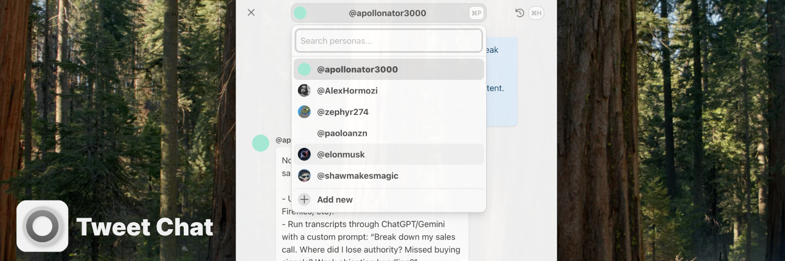

# Tweet Chat V2

<div align="center">
    
    <i>AI powered chat with your own favorites Twitter accounts.</i>
</div>

## ✨ Features

- 🖥️ User-friendly GUI for managing personas and chats.
- 🐦 Secure Twitter scraping for profiles and tweets.
- 🤖 AI-generated personas based on tweets.
- 💬 Chat with personas mimicking Twitter styles.
- 🗂️ Manage and view chat history.
- 🔒 Secure storage for credentials and API keys.
- 🌐 Cross-platform support for macOS, Linux, and Windows.

## 📋 Prerequisites

- **Node.js**: Required for development and building (check `package.json` for specific version compatibility).
- **Docker**: Optional, for containerized building (see `Dockerfile` and related scripts).
- **Twitter Credentials**: Username, password, and email are required for the initial login to enable scraping. These are stored securely within the application.
- **OpenAI API Key**: Required for AI persona generation and chat features. This key is also stored securely within the application.

## 🚀 Installation

### Pre-built Binaries (Recommended)

Download the latest release for your operating system (macOS, Linux, Windows) from the project's [GitHub Releases](https://github.com/paoloanzn/tweet-chat/releases) page (link to be updated once releases are available).

### Manual Build

1.  **Clone the repository:**
    ```bash
    git clone https://github.com/paoloanzn/tweet-chat.git
    cd tweet-chat
    ```
2.  **Install dependencies:**
    ```bash
    npm install
    ```
3.  **Build the application:**

    ```bash
    npm run build:<target_platform>
    ```
    The packaged application will be in the `dist_electron` or a similar directory created by `electron-builder`.

### Docker Build

Refer to the `Dockerfile`, `docker-compose.yml`, and `docker-build.sh` script for building within a Docker container. You'll need to provide the appropriate build target as an argument to the build script. Example:

```bash
./docker-build.sh "build:mac -- --dir"
```

### 🖱️ Usage
1. Launch the Tweet Chat application executable.
2. On the first run, you will likely be prompted to enter your Twitter credentials and OpenAI API key through a setup screen.
3. Use the main interface:
    -   Select/Manage Personas (⌘P): Choose an existing persona from the dropdown menu or search for one.
    - Add New Persona (⌘N): Click the "Add new" option in the persona dropdown to scrape a new Twitter handle and generate its persona.
    - View Conversation History (⌘H): Access past chats for the currently selected persona.
    - Chat: Type your message in the input box at the bottom (focus with ⌘I) and press Enter or click the send button to chat with the selected persona. Responses from the AI will stream into the chat window.

### 🛠️ Development
#### Setup
1. Clone the repository and navigate to the project directory.
2. Install dependencies: `npm install`.

#### Running in Development Mode
Run the Vite frontend development server and the Electron app concurrently:

```bash
npm run dev
```

This uses `npm-run-all` to start `dev:vite` and `dev:electron` in parallel.

#### Formatting
Format the code using Prettier:

```bash
npm run format
```

#### Project Structure
- `dist/`: Vite build output (frontend).
- `dist-electron/`: Electron build output (packaged app).
- `src/`: Contains the Vue.js frontend code (components, `main.ts`, `state.ts`, etc.).
- `src/electron/`: Contains the Electron main process (`main.ts`), preload script (`preload.cts`), core application logic (`core/`), and services (`services/` for AI, Twitter, Store, Utils).
- `electron-builder.json` (or build key in `package.json`): Configuration for packaging the application.
- `vite.config.ts`: Configuration for the Vite frontend build.
- `tsconfig.*.json`: TypeScript configurations.

#### Building Binaries
Use the `npm run build:*` commands as described in the Installation section to package the application for different platforms using `electron-builder`.

### 📝 Notes
- The application relies on `agent-twitter-client` for scraping, which might be affected by changes in Twitter's private API or login mechanisms.
- AI model support currently focuses on OpenAI models via `@ai-sdk/openai` (e.g., gpt-4.1, gpt-4o). See `src/electron/services/ai/provider.ts`.
- Conversation history is stored locally using `electron-store`. The number of messages per conversation is limited (see `src/electron/services/store/store.ts`).
- This project is under active development, features and implementation details may change.
- Long term support is NOT guaranteed.

### 📄 License
MIT License. See the https://www.google.com/search?q=LICENSE file for details.


